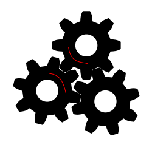
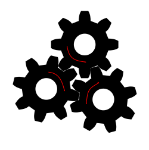

# Introduction

- Increasing length scale

## Breakdown in Stokes--Einstein--Debye

@Ediger2012

Dynamics are important to both Crystal Growth, as a rate term
and to understanding the Glass.

Consider a force pushing on the material,
the structural relaxation is the timescale
over which the material can rearrange to reduce that force.
When the force is continuous,
we are measuring the viscosity,
so the structural relaxation is used within experiments
in the place of viscosity.

This relationship between the shear viscosity and the structural relaxation
allows us to rewrite the Stokes-Einstein-Debye relations as

$$ D \propto \frac{1}{\tau_s} \text{ and } \tau_r \propto \tau_s $$

where we are using the structural relaxation time
as the fundamental relaxation time,
providing a link between
the diffusion constant $D$ and the rotational relaxation time $\tau_r$.

## Dynamic Heterogeneities

The typical approach to modelling liquid behaviour
describes the liquid as a homogeneous continuum.
This homogeneous model is completely appropriate
for describing "ordinary" liquids.
In supercooled liquids,
the dynamics slow down by many orders of magnitude
before the glass transition,
where dynamics in one region of the liquid
can be orders of magnitude faster
than dynamics in another region of the liquid.
The idea that a liquid is not homogeneous
requires a significant change in how we think about supercooled liquids.

The presence of fast and slow regions within supercooled liquids,
referred to as dynamic heterogeneities
is a phenomenon which has garnered significant interest;
it is considered to be a physical indicator of the glass transition,
a demonstration that it is more than a kinetic phenomenon.

{#fig:relaxation width=80%}

Relaxations $F(t)$ within systems undergoing Brownian motion,
whether structural or rotational will have the form

$$ F(t) = c \e^{-t/\tau} $$

where $\tau$ is the characteristic timescale of the relaxation.
These produce the curves at higher temperatures shown in @fig:relaxation
which also has curves which don't fit this description,
an indicator of heterogeneous dynamics.
The other relaxations display a stretched exponential behaviour
and are fit to the Kohlrausch--Williams--Watts (KWW) equation [@Williams1970;@Kohlrausch1854]

$$ F(t) = c \e^{-(t/\tau_\alpha)^\beta} $$

The stretched exponential function provides terms to describe
the two-step relaxation process in @fig:relaxation.
The short timescale relaxation is known as the $\beta$ relaxation,
in relation to the $\beta$ term of the stretched exponential,
and is an indicator of dynamic heterogeneities.
The longer timescale relaxation, denoted the $\alpha$ relaxation
is related to the value of $\tau_\alpha$.
This stretched exponential behaviour has to describe
dynamic heterogeneities and relaxation behaviour
in experimental studies of supercooled relaxations
measured using a range of techniques, including;

- probe molecules [@Cicerone1995a;@Cicerone1995b],
- hole burning experiments [@Schmidt-Rohr1991;@Cicerone1995;@Schiener1997],
- photobleaching [@Cicerone1993], and
- optical microscopy [@Bartko1999].

While the results from experimental systems
are useful in describing the presence of dynamic heterogeneities,
with some even indicating a spatial component.
It is through simulations that the nature of the heterogeneous
dynamics has been understood.
One of the characteristic pictures of dynamic heterogeneities
is that of @Hurley1995, [@fig:dynamic_heterogenaeties]
where there are regions of particles that retain their original structure,
while others have moved many molecular distances.
This visualisation of the dynamic heterogeneities
is one which has been, and still is, used extensively
in describing this phenomenon.
It captures the phenomenon so succinctly
because the simulation is in 2D,
allowing everything to be represented on the page.
A similar picture is painted in 3D systems, [@Donati1999]
with spatially separated regions of fast and slow particles.

{#fig:dynamic_heterogenaeties width=80%}

There are many theoretical foundations
for understanding dynamic heterogeneities.
One of the more general frameworks
originally introduced by @Goldstein1969
is the representation of configuration space
as a high dimensional potential energy landscape.
A single configuration is then a point
on this high dimensional surface.
This idea is depicted in @fig:potential_energy_landscape.
In a high temperature liquid,
there is free movement around the potential energy surface,
giving rise to the homogeneous dynamics.
At the lower temperatures close to the glass transition
there are more limitations to the movement of particles,
with the standard barriers to motion larger than
the energy of particles,
as depicted in @fig:potential_energy_2d.
However because of the high dimensionality of the space,
instead of motion being impossible,
it uses additional dimensions (@fig:potential_energy_3d)
observed as the collective motion of multiple particles.
One of the results from this analysis of the collective motion,
is that as the temperature is lowered
towards the glass transition temperature $T_g$,
one would expect motion to become more difficult,
requiring more degrees of freedom,
which incorporates the motion of a larger number of particles.
This growing number of particles
can be characterised as a *length scale*,
being the size of mobile regions;
a measurable property in both simulation an experiment.
Despite many experiments [@cite] searching for
a growing length scale as the temperature drops,
there has been no data to suggest this is the case.

:::{class=subfigures id=fig:potential_energy}

<!-- These captions are intentionally left blank -->
<!-- markdownlint-disable MD045 -->
{#fig:potential_energy_2d width=49%}
{#fig:potential_energy_3d width=49%}
<!-- markdownlint-enable MD045 -->

When we look at two dimensions (a),
there is no possible path for getting from A to B
without going over the large energy barrier.
However, by adding an extra dimension (b),
it becomes possible to go around.

:::

{#fig:dynamic_heterogenaeties width=80%}
](../01_Introduction/figures/potential_energy_surface.png){#fig:potential_energy_landscape width=80%}

Further evidence for the idea that the structure
plays a role in the resulting dynamics
is work done by @Widmer-Cooper2004,
where the same structural configurations
were initialised with randomised momenta.
Despite the randomisation of the momenta,
the resulting dynamics of each configuration were similar,
most noticeable when looking at dynamic heterogeneities.
Dynamic heterogeneities were present
in the same locations of a configuration
regardless of initial particle momenta.

Where the structure has been tied to dynamics
is in the study of jamming of granular materials.[@cite]
This has also been applied to crystals and glasses.[@cite]
The premise is that particles are unable
to move past each other. [@fig:jamming_diagram]
With molecules that contain concave components,
there is even more susceptibility to jamming.
Another aspect of jamming which has less attention
is rotational jamming.

{#fig:jamming_diagram width=80%}

Gears are a method of mechanically transferring rotational motion
from one location to another,
with the requirement that they rotate in opposite directions.
When there are many gears in a plane,
the requirement for rotation in opposite directions
can lead to the jamming of rotational motion.
Take for example @fig:gears_triple,
adding the third gear in a triangular lattice
now means that none of the gears can turn,
completely preventing rotational motion.
This demonstrates the importance of structure
on a gear network,
with square lattice sites allowing rotations
while triangular sites inhibit them.
@Zwanzig1987 models the effect of
jamming and rotational clustering of gear networks,
noting that clusters of the gears in square lattice
will all rotate together acting as a single body.

:::{class=subfigures id=fig:gears}

{#fig:gears_triple width=40%}
{#fig:gears_quad width=40%}

If we model the rotational motion of a gear network
Where there are three gears,
like in a triangular lattice
the rotational motion is jammed,
while four gears allow motion to propagate.

:::

## Stokes--Einstein--Debye Models

@Shi2013

Current models of motion in the liquid state
are based on the Stokes-Einstein-Debye relationships[@Debye1929],
which are theoretical models of collective motion
derived from particles undergoing Brownian motion[@Einstein1956].
These models define characteristic rates of motion
known as diffusion constants,
with $D_t$ being the diffusion constant of translational motion
while $D_r$ is the diffusion constant of rotational motion.
The Stokes--Einstein equation for translational motion

$$ D_t = \frac{k_\text{B} T}{6 \pi \eta R} $$

and the Stokes--Einstein--Debye relation for rotational motion

$$ D_r = \frac{k_\text{B} T}{8 \pi \eta R^3} $$

where

- $\eta$ is the shear viscosity, and
- $T$ is the temperature.

These equations can be simplified as follows

$$ \frac{D_t \eta}{T} = \text{constant} $$ {#eq:stokes_einstein}

and

$$ \frac{D_r \eta}{T} = \text{constant} $$ {#eq:einstein_debye}

which allows us to express a relationship
between the rotational and translational diffusion

$$ D_t \propto D_r $$ {#eq:sed_proportionality}

when both are at the same temperature and viscosity.

@Bian2016

One of the detractors of Brownian dynamics
is that it describes the dynamics of independent events,
making no account for momentum.
An alternative method of describing the dynamics of particles
is through Langevin Dynamics,
which does include the momentum of particles.
This ends up giving the same result
for the Stokes-Einstein-Debye relations.
This is because it is possible to consider
Brownian Dynamics as a more granular form
of Langevin Dynamics.

The Stokes-Einstein-Debye models are suitable for describing
the dynamic properties of most liquids, however,
there are instances in supercooled liquids,
where the Stokes-Einstein-Debye relations
are insufficient for describing the dynamics which are observed.
The breakdown in dynamics is primarily
a case of the underlying particle motions
no longer adhering to Brownian motion.

### Breakdown in rotational coupling

Another unusual behaviour of supercooled liquids,
is the breakdown of the Stokes--Einstein--Debye relations,
that is, the proportionality in @eq:sed_proportionality
no longer holds true.
Experimental evidence of this is displayed in @fig:trans_rot_otp
and supported by additional studies. [@cite]

{#fig:trans_rot_otp width=80%}

The idea that the rotational and translational diffusion constants
were proportional to each other
there is the assumption that there is a single "force"
governing the motion of particles.

Our current understanding of the liquid state
breaks down for supercooled liquids.
The assumptions we have made developing
a theoretical understanding of the liquid,
do not take into account the unusual behaviour
observed in supercooled liquids.

The Debye model predicts an exponential decay of the $l$th rank
single-particle orientation time correlation function $C_l^s$,

$$ C_l^s = \exp\left(\frac{-t}{\tau_l}\right) $$

which gives the corresponding relaxation time

$$ \tau_l = \frac{1}{l(l+1)D_r}, $$

where $D_r$ is the rotational diffusion coefficient.
Comparing this relationship for
the first and second-order relaxation functions

$$ \tau_1/\tau_2 = \frac{2(2 + 1) D_r}{1(1+1) D_r} = 3$$

When molecules rotate inertially, that is,
there are large angular displacements between collisions.
The type of relaxation is no longer exponential,
and can be identified by the ratio $\tau_1/\tau_2$
falling in the range

$$ 1 < \tau_1/\tau_2 < 3 $$

The value of 3 (or 4 for 2D systems) is given by Brownian dynamics,
that is, assuming rotations take place through a process of small random steps.
Where there are large changes in orientation,
the two relaxation times become correlated,
since there are much fewer steps required for rotational relaxation to occur,
with the limit of this being
single jumps account for both relaxations simultaneously.

In experimental and simulation studies
at high temperatures [@Laage2006]
the relationship $\tau_1/\tau_2 = 3$ has held true.
In supercooled liquids however,
there have been many studies
which have found $\tau_1/\tau_2 < 3$,
which has given credence to the
idea of rotational relaxations
taking place through the process of large angular jumps.

## Theoretical Treatment of Dynamics

@Cummins1997 is a great review
@Royall2018 also reviews the topic

There are numerous methods which can be used to describe
different aspects of the motion of particles.
However each individual piece of information
is only able to tell part of the story,
so we need to be able to have some theoretical framework
which provides a scaffolding for combining these values.

### Free Energy Landscape {#sec:energy_landscape}

@Niblett2016
@Wales2018
@deSouza2017
@Ballard2017
@Niblett2017

In Goldstein's[@Goldstein1969] energy landscape model of dynamics,
this change in dynamic behaviour is characterised
by the transition from free diffusion,
where the energy of the particles
is greater than the energy of the barriers between configurations,
to activated diffusion,
where the transition from one position to another
requires the concentration of energy at a certain point.
There has been evidence of this transition from
free to activated diffusion in simulations of atomic systems [@Barrat1991;@Wahnstrom1991]
where the dynamics change from many small random motions
to a large motions from one site to another
often as part of a correlated motion.
Where dynamics occurs by the process of large jumps,
the assumptions made about the Brownian motion start to break down.
While atomic systems seem to make the transition to jump dynamics,
there is not the same evidence for molecular systems, [@Lewis1994;@Barrat1991;@Wahnstrom1991]
namely the Lewis--Wahnström model of *ortho*-terphenyl,
where rotational motion occurs through jump dynamics
while the translational motion takes remains Brownian in nature.

One of the key predictions of the energy landscape model of dynamics
is the incorporation of more dimensions in the motion
when the molecules no longer have the energy
to cross potential energy boundaries.
Since including more dimensions to a motion
is including more particle degrees of freedom,
the increased dimensionality is expected to manifest in
an increase in a length scale as the temperature drops.
Despite significant effort searching for
this increasing length scale, [@cite]
there has been no evidence of it.

### Jamming Transition

@vanHecke2010
@Torquato2010

An alternative structural model of the supercooled liquid
is the idea of the jamming transition
which is adapted from an understanding of granular materials.
[@Silbert2002;@Cates1998;@Cates2005;@Liu2010;@Torquato2010;@vanHecke2010]
A particle is considered jammed
when the number of contacts
is enough to restrict all the degrees of freedom,
this is known as *isostatic* jamming
with the requisite contact count $z_\text{iso}$ being

$$ z_\text{iso} = 2d_f $$

where $d_f$ is the number of degrees of freedom
available to a molecule ($d_f=3$ for our trimer).
When a molecule is jammed,
there are no degrees of freedom available
meaning it is unable to move.
Using contact numbers is notable
for concave shapes like the Trimer molecule
as the concavities allow for contact numbers
well above $z_\text{iso}$. [@Jennings2015]

The concept of jamming also applies to rotational motion
where @Zwanzig1987 considers a liquid of 2D gears.
Once three gears come in contact with each other,
they are no longer able to rotate.

### Geometric Frustration

Building upon some of the ideas of the jamming transition
is a model of geometric [@Frank1952] or packing [@Tarjus2005;@Kivelson1995] frustration.
This considers small regions of the liquid,
which form structures that minimise the local free energy,
however these structures are then unable to tile space.
This gives small regions of favourable local structure
which are highly favourable and unlikely to diffuse.

This idea of geometric frustration is notable for the Trimer molecule,
as there are a range of crystal structures it can take on. [@sec:stability-of-crystal-phases]

### Conclusion

The jamming model looks at dynamic heterogeneities
in a different way to Goldstein's energy landscape model.
The jamming describes the slow parts of the heterogeneities,
molecules do not have the degrees of freedom to rearrange.
Conversely, the energy landscape explains the regions of motion,
co-operatively rearranging to move between local minima.

Despite these models being useful in understanding
the processes of motion within a liquid,
there is still the decoupling of the rotational and translational motion.
Why is one type of motion
more affected by supercooling than another?
A consequence of dynamic heterogeneities,
which is measured by the non-Gaussian parameter $\alpha$
is the deviation of the distribution of motions
from that of a Gaussian distribution,
with the dynamic heterogeneities having
many orders of magnitude difference
between the fastest and the slowest particles.
It is entirely possible
that the differences between
the translational and rotational dynamics
is a result of the averaging we are using.
For the diffusion constant measured from the mean-squared-displacement,
particles with fast motions contribute disproportionately
to increasing this value,
while for the rotational relaxation it is
the slow particles which increase this value.

### Coupling of Translational and Rotational Motion

Part of this story which is still being actively studied
is the coupling of the rotational and translational motions
on short timescales.
A famous result is the decoupling of rotational and translational
motion in a supercooled liquid, [@Chang1994;@Griffin2012;@Fujara1992]
indicating a breakdown in the Stokes-Einstein-Debye
theory of dynamics.
This result however is an observation of the overall properties
and doesn't consider the microscopic coupling that takes place.
In the potential energy landscape model
as the temperature is lowered,
it is predicted that more degrees of freedom
will be used for motion to occur
and some of these are in
the rotational motion of molecules.
This coupling between rotational and translational motion
on the microscopic scale
has been observed in simulations of water [@Meyer2019;@Nair2019;@Faraone2003]
and liquid crystals [@Jose2006].

## Goals for Dynamics

In @sec:molecular_relaxation we introduce new relaxation quantities
which describe the relaxations of individual molecules.
These molecular relaxation quantities allow more insight
into the dynamic heterogeneities present in supercooled liquids.
As part of introducing these quantities
we establish their equivalence to the quantities measured in @sec:dynamics_results.
Finally to conclude this chapter
we use a combination of the standard dynamics quantities from @sec:dynamics_results
and the newly introduced molecular relaxations from @sec:molecular_relaxation
to explain the breakdown in the Stokes--Einstein--Debye relations.
