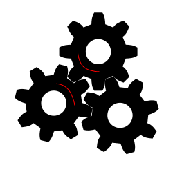
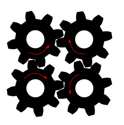

# Introduction

## Breakdown in Stokes--Einstein--Debye

The Stokes--Einstein--Debye (SED) theory of dynamics
describes a series of relations (@eq:sed_proportionality) between dynamics quantities.
These relations describe the dynamics of a wide range of liquids,
however, they start to break down in fragile liquids
close to the glass transition temperature.
The canonical example of this is the decoupling
of rotational and translational diffusion [@Chang1994;@Griffin2012;@Fujara1992]
shown in @fig:trans_rot_otp.
This decoupling results from a change in the viscosity dependence
of the translational diffusion having the relationship $D_t \propto \eta^{-0.75}$,
slower than the expected $D_t \propto \eta^{-1}$. [@Chang1994]

There is a general consensus on the presence of
decoupling within experimental studies, [@Chang1994;@Griffin2012;@Fujara1992;@Jose2006;@Chong2009]
however, there has been difficulty replicating these results in simulations
demonstrated within this thesis in @sec:trans_rot_decoupling.
@Shi2013 find a similar relationship to those of experiments
for the decoupling of translational diffusion and viscosity,
a result mirrored by @Sengupta2013.
Neither of these studies looked at the rotational motions of particles.
Recent simulations by @Kawasaki2019 on supercooled water
find both a decoupling between translational diffusion and viscosity,
and a decoupling of translational and rotational diffusion.
However, the simulations describe a slowdown of rotational motion
relative to the translational motion,
opposite of the observations in experimental systems. [@Chang1994]
This slowdown of rotations relative to translations
is observed more widely in simulation studies. [@Jose2006;@Chong2009]
A possible explanation for the different behaviour in simulations
is the method used to measure the rotational relaxation,
with @Kawasaki2019 finding the degree of decoupling
to be dependent on the Legendre polynomial used to measure
the rotational relaxation.
The first order polynomial describing largest motion, is closest to the Diffusion constant,
while the sixth order polynomial describing being the smallest motion
has a temperature dependence similar to the viscosity.

When calculating the translational diffusion constant
we describe the long timescale behaviour of the mean-squared-displacement
by finding the slope as time goes towards infinity.
The long timescales associated with this calculation
allows many relaxations to take place
limiting the impact of jump dynamics.
The same approach to describing the long timescale behaviour
can also be achieved for rotational motion
using the Einstein formalism for the rotational diffusion constant;
[@Kim2015;@Lombardo2006;@Meyer2019]

$$ D_r = \lim_{t\to\infty} \frac{1}{2tN}\sum^N_{i=1}\langle \Delta \theta^2 \rangle $$ {#eq:rot_diffusion}

@Kim2015 compared the Debye formalism, described in @sec:intro_sed
to the Einstein formalism described above
finding the same results for a colloidal system
in which jump dynamics are unlikely to play a role in rotational relaxation.
Using the two methods of describing rotational motion
on the Lewis--Wahnström model, @Lombardo2006 find that
the Debye formalism matches the results from simulations
while the Einstein formalism matches results from experiments.
This study observes the different behaviours of the rotational formalisms,
yet it doesn't delve into why the different behaviours are observed.

One explanation of the decoupling of
rotational diffusion and translational diffusion in simulations
is the choice of quantities used.
In the presence of dynamic heterogeneities
the translational diffusion constant $D_t$
and the rotational relaxation time $\tau_r$
represent different ends of the distribution of timescales.
The translational diffusion describes the motion of fastest particles,
while the rotational relaxation is dominated by the slowest particles.
Consider two regions of dynamics,
one containing fast particles with $\tau_\text{fast}$ and $D_\text{fast}$
and the other containing slow particles with $\tau_\text{slow}$ and $D_\text{slow}$,
where $\tau$ is a relaxation time and $D$ is a diffusion constant.
These values are such that $\tau_{fast} << \tau_{slow}$ and
$D_\text{fast} >> D_\text{slow}$.
When finding the average relaxation time

$$ \frac{\tau_\text{fast} + \tau_\text{slow}}{2} \approx \frac{\tau_\text{slow}}{2} $$

and the average diffusion constant

$$ \frac{D_\text{fast} + D_\text{slow}}{2} \approx \frac{D_\text{fast}}{2} $$

we can see how these relaxations behave differently.
Here the presence of dynamic heterogeneities results in
a decoupling of translational and rotational motion
by the choice of parameters.

### Breakdown in rotational coupling

A limitation of the Stokes--Einstein model,
acknowledged by Einstein as such, [@Einstein1907;@Bian2016]
is that the inertia of a particle is neglected.
This means that the time resolution of observations becomes important
for the motions of particles. [@Pusey2011;@Li2013]
The SED relations are based on Brownian dynamics
however, there is evidence of rotational motions not described by Brownian motion,
in the form of jump dynamics. [@Das2015;@Nair2019;@Laage2006;@Andreozzi1996;@Jose2006]
When describing rotation dynamics using spherical harmonics
known as the Debye formalism, [@Lombardo2006]
there are multiple choices for the order of the Legendre polynomial $l$.
@Eq:debye_rotational_diffusion describes the relationship
between the relaxation times for difference choices of $l$.
The ratio $\tau_1/\tau_2$ is used to measure contribution
of large angular jumps to rotational relaxation. [@Jose2006;@Kivelson1970]
The Debye model predicts an exponential decay of the $l$th rank
single-particle orientation time correlation function $R_l^s$,

$$ R_l^s = \exp\left(\frac{-t}{\tau_l}\right) $$

which gives the corresponding relaxation time

$$ \tau_l = \frac{1}{l(l+1)D_r}, $$

where $D_r$ is the rotational diffusion coefficient.
Comparing this relationship for
the first and second-order relaxation functions

$$ \tau_1/\tau_2 = \frac{2(2 + 1) D_r}{1(1+1) D_r} = 3$$

When molecules rotate inertially, that is,
there are large angular displacements between collisions.
The relaxation is no longer exponential,
and can be identified by the ratio $\tau_1/\tau_2$
falling within the range

$$ 1 < \tau_1/\tau_2 < 3 $$

The value of 3 (or 4 for 2D systems)
indicates the rotations are governed by Brownian dynamics,
that is, rotations take place through a sequence of small random steps.
When there are large changes in orientation,
the two relaxation times become correlated
as there are fewer steps for relaxation to occur.
At the limit, a single large motion can describe
both relaxation quantities simultaneously
which is described the $\tau_1/\tau_2 = 1$

The presence of jump dynamics describes a process
by which the rotational motion deviates
from that of the SED relations,
however it doesn't explain why the rotational motion is slower.
One possible explanation is to
consider the molecular structure as a network of gears, [@Zwanzig1987]
where contacting molecules transfer angular momentum.
As a network of gears,
there is the requirement that the angular momentum of neighbouring molecules
is equal and opposite.
When there are many gears in a plane,
this requirement for rotation in opposite directions
can lead to the jamming of rotational motion.
Take for example @fig:gears_triple,
adding the third gear in a triangular lattice
now means that none of the gears can turn,
completely preventing rotational motion.
In modelling a random network of gears,
similar to that which would be found in a liquid,
@Zwanzig1987 found that the networks resulted in
a very slow decay or rotational relaxation
dominated by large clusters relaxing slowly.

:::{class=subfigures id=fig:gears}

{#fig:gears_triple width=40%}
{#fig:gears_quad width=40%}

If we model the rotational motion of a gear network
where there are three gears,
like in a triangular lattice
the rotational motion is jammed,
while four gears allow motion to propagate.

:::

## Dynamics in Potential Energy Landscapes

The presence of dynamic heterogeneities
is a significant feature as a liquid approaches
the glass transition temperature,
yet despite being one of the most extensively studied problems
in condensed matter physics [@Debenedetti1997;@Berthier2011;@Karmakar2014]
it is still poorly understood.
There are many theoretical foundations
for understanding dynamic heterogeneities,
with one of the more general frameworks introduced by @Goldstein1969
represents each configuration as a point
on a high dimensional potential energy landscape.
This idea is depicted in @fig:potential_energy_landscape,
showing an example two dimensional representation.
In a high temperature liquid,
a configuration is free to move around the potential energy surface
with the energy being larger than any of the barriers between configurations,
giving rise to homogeneous dynamics,
where particles are free to diffuse.
At temperatures close to the glass transition,
the size of the energy barriers between configurations
is comparable to the energy of the liquid
changing the types of motions which take place.
In this low energy state,
the kinetically favourable transition states are too high in energy,
instead motion occurs through transition states
which involve the cooperative motion of many particles.
This low energy state results in diffusion
becoming an activated process,
requiring concentrations of energy to occur.
There has been evidence of the transition from
free to activated diffusion in simulations of atomic systems [@Barrat1991;@Wahnstrom1991]
where the motions change from many small random motions at high temperatures
to a large motions from one site to another at low temperatures,
often involve correlated motions of particles.
This structural description provides another method to describe jump dynamics
as the motions between local potential energy minima. [@Doliwa2003a;@Doliwa2003]
The structural description of jump dynamics
makes no distinction between
the rotational jumps described in @sec:intro_jump_dynamics
and translational jumps.

{#fig:potential_energy_landscape width=80%}

When considering the transport properties of particles undergoing jump dynamics
we can consider an alternate formulation of the diffusion constant $D$ [@Doliwa2003]
constructed from the effective jump length $a(T)$
and the mean waiting time $\langle \tau(T) \rangle$

$$ D_\text{jump}(T) = \frac{a(T)^2}{6N\langle \tau(T) \rangle} $$ {#eq:jump_diffusion}

where $N$ is the number of particles in the simulation.
The mean waiting time is the time for any particle to make a jump.
In defining diffusion in this way we are assuming
all particles undergo motions through jump dynamics.
However, the dynamic heterogeneities synonymous with a potential energy landscape
describe a wide range of behaviours.
@Dueby2019 defines a diffusion constant that combines
the both aspects of diffusion,
the Brownian component and the Jump component,
arguing both are required to fully describe diffusion.

A key component part of the potential energy landscape model
is that the structure plays a role in the dynamics,
defining the types of transitions taking place.
Whether the high energy allows for moving smoothly through the configuration space,
or a low energy requires large rearrangements to jump between
minima in the configuration space.
This importance of the potential energy landscape
in the dynamics is highlighted in work by @Widmer-Cooper2004,
where a simulation study initialising
the same structural configuration with a randomised momenta,
found the same dynamic heterogeneities regardless of initial momenta.

## Goals for understanding dynamics

In @sec:molecular_relaxation we introduce new relaxation quantities
to describe the relaxations of individual molecules.
These molecular relaxation quantities allow more insight
into the dynamic heterogeneities present in supercooled liquids.
In @sec:sed we use these new molecular relaxations
to describe the relationship between
jump dynamics and dynamic heterogeneities.
These relationships are then also used to
describe the coupling between rotational and translational motions
on the molecular level.
The insights from this understanding
is then used to gain insight into
the Stokes--Einstein--Debye model of dynamics.
All the dynamics quantities calculated in this section
use the same simulation trajectories as @sec:Dynamics
containing 1023 molecules,
with all simulation conditions documented in @sec:methods_dynamics.
