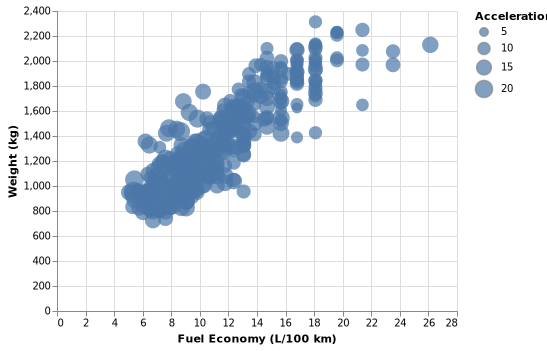
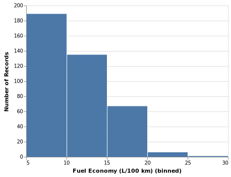
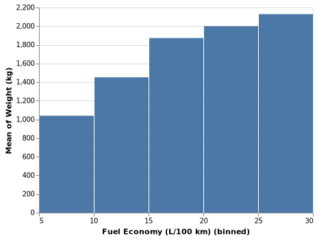

# Adventures in the Python Visualisation Landscape

2018-03-17

Calling the current python visualisation landscape fragmented would probably be an understatement,
since itself requires a [visualisation][jakevdp pycon vis] to even begin to comprehend.
For various reasons I have been unhappy with the tool I was using for visualisation at that time
and I have been searching for the one visualisation package to rule them all (spoiler: it doesn't exist)

About a year ago I was using Matplotlib for all my figures,
which enabled me to create anything I wanted,
usually with a stackoverflow answer giving me a working example to adapt.
Problem was, nearly everything required a stackoverflow post or the documentation,
making the process of building these figures slow and tedious.
Around the same time I was getting fed up with Matplotlib,
I found Jake VanderPlas' PyCon talk on [The Python Visualisation Landscape][jakevdp pycon vis]
which has since acted as both a map and a list of achievements to unlock.

### Altair 1.2

Somewhat naturally the first package I looked at for improving my visualisation workflow was
Altair which was at the time a 1.2 release.
At the time I thought it was fine for simple figures,
however my data was not formatted to make the most of what Altair could offer,
which as a relative newbie to pandas was frustrating.
Another sticking point with Altair was working out how to customise figures,
After Matplotlib, I was expecting to search what I wanted to in Google
and have appropriate stackoverflow answer on the first page of results.
With Altair being a new package, this how-to style documentation didn't exist,
which meant I never worked out how to customise the figure.
The most frustrating of the default settings was the axis labels
which use the SI Prefix for large numbers
i.e. 1M for $1 \times 10^6$  and 1n for $1 \times 10^{-9}$,
something which I never worked out how to change at the time.
Another problem I had with Altair (and Matplotlib) was the lack of interactivity.
I was in the early stages of data investigation
which required both a high level overview of the trends,
while also being able to look at smaller regions in more detail.
Having to constantly change axis ranges was
making it slow and frustrating to create a figure with the appropriate view.

### Bokeh

With an emphasis on interactivity,
[Bokeh][bokeh] was the tool I was looking for to investigate data on different scales.
With the ability to generate figures in a notebook,
for quick visualisations of datasets to understand the data,
and compare it with previous studies,
and also as a [Bokeh server][bokeh server] application,
to perform standard analyses on large volumes of data,
like ensuring a simulation is running properly.
Despite having these interactive visualisations,
bokeh is lacking in the same way as Matplotlib,
it takes a long time to specify everything required to create the figures.
While there was a start on a high level plotting interface in the form of [bkcharts][bkcharts],
the code is now unmaintained and directs users to Holoviews.

### Holoviews

Like Altair, [Holoviews][holoviews] is a declarative plotting interface,
providing a quick and simple interface for constructing figures.
Holoviews is structures around the idea of
describing data on creation of the dataset,
rather than the construction of the figure,
allowing for simple figure definitions.
Rather than being a library that actually creates a figure,
Holoviews performs the reasoning about the dataset
and passing the rendering off to Bokeh, Matplotlib, or Plotly.
I initially saw this as a big strength of Holoviews,
that I could generate interactive visualisations in bokeh,
change the output to Matplotlib and have a configurable figure for publication.
In practice this is not so simple,
with some modifications to plot style parameters
changing between the different output formats
and having a limited range of customisations.

The drawback of having this special annotated data object
is that you lose all the flexibility of having a pandas DataFrame
and the vast array of operations that allows.
This is important to me
because my field of science has a long history of
researchers taking some quantities and
combining them to give a describable temperature dependence.
This lack of flexibility led me back to Altair,
this time version 2.0.

### Altair 2.0

Why Altair again?
When I first tried Altair I was approaching it from Matplotlib,
with it's extensive documentation
in the form of the technical reference and the numerous how to guides.
This time I was approaching it from Bokeh and Holoviews,
both of which are relatively new libraries with some teething problems.
As a consequence I had become much better at problem solving issues
and navigating technical reference materials.
Another major moment of discovery was making the connection
that since Altair implements the Vega-Lite specification,
I should have a look at the [Vega-Lite documentation][vega-lite docs].
This turned out to be particularly helpful
because the Vega-Lite documentation
is currently more extensive than for [Altair][altair docs].

It was in reading the Vega-Lite documentation
that I finally understood how to use transform functions in Altair.
These are a set of functions that perform computations on the input dataset to generate the resulting figure.
This allows me to have a single canonical dataset,
with data transformations like ratios of two quantities tied to the figure,
rather than following awkwardly named variables around.
One example of these functions is
to make the data in the cars dataset
useful for the majority of the world's population
by converting the units as part of the figure definition.

```python
import altair as alt
from vega_datasets import data

cars = data.cars()

chart = alt.Chart(cars).mark_circle().transform_filter(
    alt.expr.datum.Miles_per_Gallon > 0
).transform_calculate(
    'Fuel Economy (L/100 km)', '235.2 / datum.Miles_per_Gallon'
).transform_calculate(
    'Weight (kg)', 'datum.Weight_in_lbs * 0.45'
)
chart.encode(
    x='Fuel Economy (L/100 km):Q',
    y='Weight (kg):Q',
    size='Acceleration:Q'
)
```


This allows for only storing the fundamental values in the dataset
and being able to compute derived values as part of the figure,
something that is particularly useful in my workflow.

This computing of values,
also extends to the computation of histograms,
complete with shortened notation.
Using the chart object from above it is possible to easily create a histogram

```python
chart.mark_bar().encode(
    x=alt.X('Fuel Economy (L/100 km):Q', bin=True),
    y='count():Q',
)
```


Where setting `bin=True` will create bins with the default parameters,
and the `count():Q` on the `y` axis counts the elements in each bin.
Instead of `count()` it is also possible to perform other [aggregations][vega-lite aggregations],
like computing the mean of a column.

```python
chart.mark_bar().encode(
    x=alt.X('Fuel Economy (L/100 km):Q', bin=True),
    y='mean(Weight (kg)):Q',
)
```


For a more comprehensive view of using Altiar,
have a look at either the [Example Gallery][altair example gallery],
or a [case study][altair case study].

Each of the visualisation libraries in python
have their own strengths and weaknesses,
types of visualisations they excel at,
and others you wouldn't want to try.
For me, while Altair does still have a some quirks,
most notably in the handling of [large datasets][altair notebook size],
and a somewhat complicated method of [setting titles][altair setting titles],
it provides a simple and intuitive interface to data
which at the time of writing makes it the first tool I will reach for
to understand a dataset.


[jakevdp pycon vis]: https://youtu.be/FytuB8nFHPQ?t=3m53s
[xkcd competing standards]: https://xkcd.com/927/
[bokeh]: https://bokeh.pydata.org/en/latest/
[bokeh server]: https://bokeh.pydata.org/en/latest/docs/user_guide/server.html
[bkcharts]: https://github.com/bokeh/bkcharts
[holoviews]: https://holoviews.org
[vega-lite docs]: https://vega.github.io/vega-lite/docs/
[vega-lite aggregations]: https://vega.github.io/vega-lite/docs/aggregate.html#ops
[altair docs]: https://altair-viz.github.io/index.html
[altair example gallery]: https://altair-viz.github.io/gallery/index.html
[altair case study]: https://altair-viz.github.io/case_studies/exploring-weather.html
[altair notebook size]: https://github.com/altair-viz/altair/issues/249
[altair setting titles]: https://github.com/altair-viz/altair/issues/585
